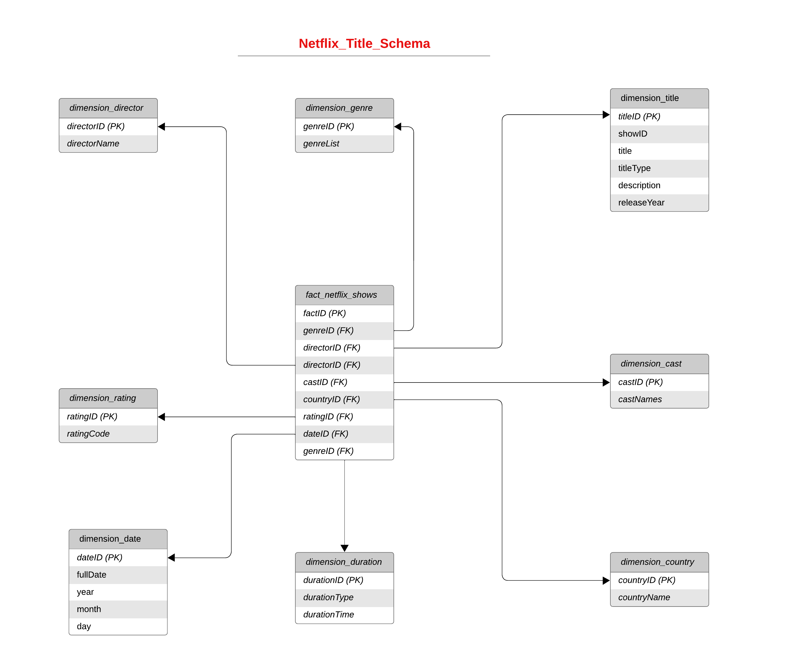

**Souvik – Ambyint Technical Assessment – Data Engineer**

**Stage 1** : Create a database, schema, and tables based on the netflix_titles.csv data using a Dimensional Modelled Design with a Snowflake trial account. Please consider primary, foreign, and table clustering keys.

- The DDL scripts can be found in [stage1.sql](stage1.sql).
- DML Diagram

  

- Dimensions and Facts table image can be found here [dimensions_facts_tables.png](/data-engineering/screenshots/dimensions_facts_tables.png)

**Stage 2** : Create an automated process using Snowflake to ELT the netflix_titles.csv data from the csv file into the tables.

- The DDL scripts can be found in [stage2.sql](stage2.sql).
- Stage details can be found here: [netflix_shows_stage.png](/data-engineering/screenshots/netflix_shows_stage.png)
- Procedure details can be found here: [NETFLIX_SHOWS_ETL(file_name STRING)](/data-engineering/screenshots/netflix_shows_ETL.png)

**Stage 3**: Create a python program to:

    1. Generate new source files of the same format as netflix_titles.csv. Each new file should contain some new records (with fictitious data) that should be inserted into the dimensionally modeled tables and some existing records that require updates.
    2. Save the files to a source location for automated ingestion into Snowflake.

- The python script can be found in [stage3.py](stage3.py).
- The files created by the python script is uploaded in the stage NETFLIX_SHOWS_STAGE. The script has invoked the nextflix_updated_titles2.csv and nextflix_updated_titles.csv by calling the stored procedure using netflix_shows_ETL('{file_name}') function.

**Stage 4** : Write SQL to validate the data staged and loaded, for example:

Identify and report any missing, invalid or strange data. This can be anything you determine in the provided file or have generated in Stage 3.

- The DDL scripts can be found in [stage4.sql](stage4.sql).
- The outputs are expained in [stage4.md](stage4.md) file.

**Stage 5** : Write SQL to return the following:

    What is the most common first name among actors and actresses?

    Which Movie had the longest timespan from release to appearing on Netflix?

    Which Month of the year had the most new releases historically?

    Which year had the largest increase year on year (percentage wise) for TV Shows?

    List the actresses that have appeared in a movie with Woody Harrelson more than once.

- The DDL scripts can be found in [stage5.sql](stage5.sql).
- The outputs are expained in [stage5.md](stage5.md) file.
