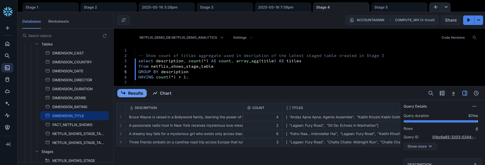
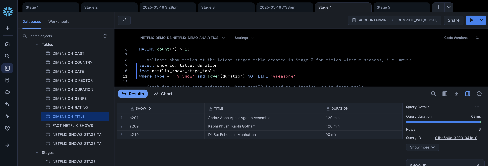
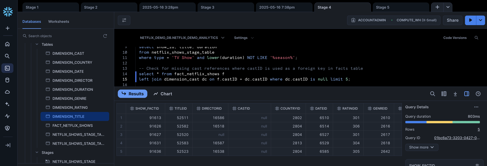
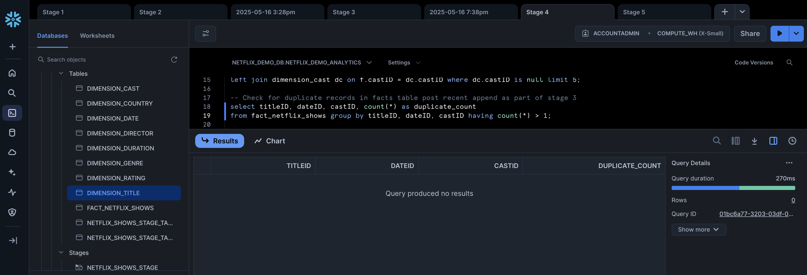
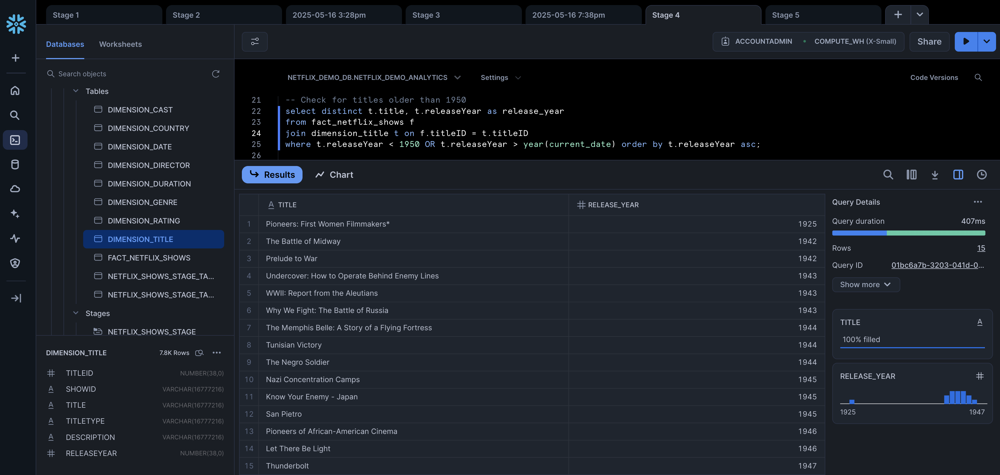
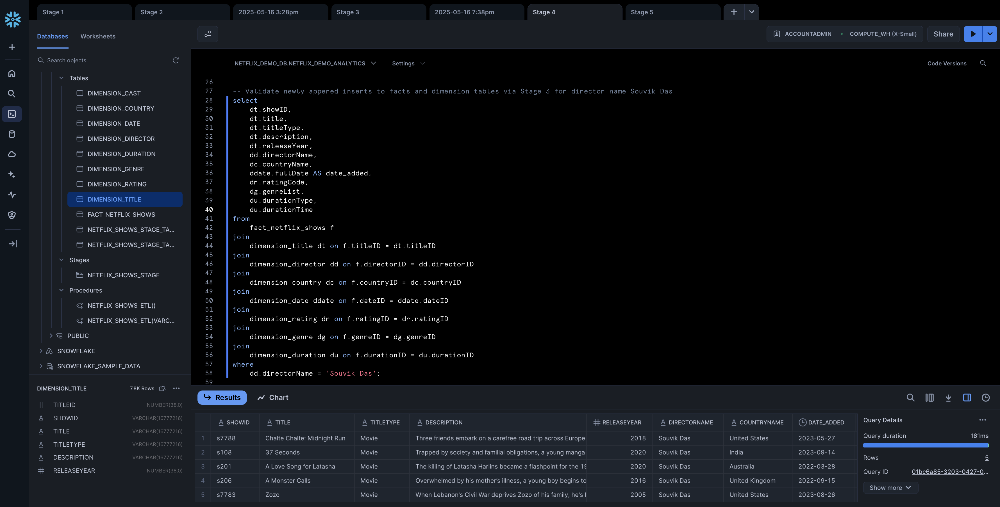
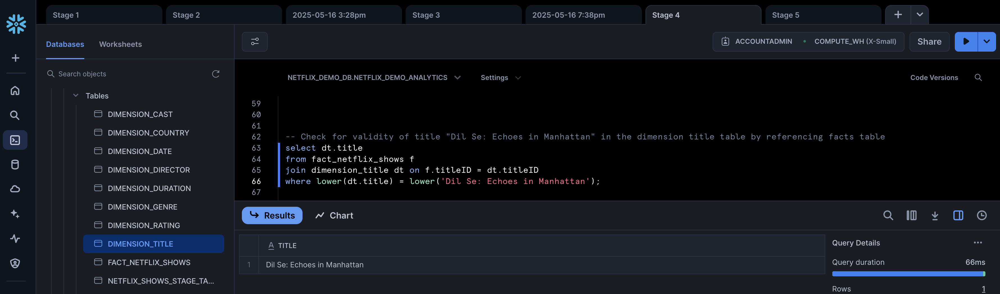

**Souvik – Ambyint Technical Assessment – Data Engineer**

**Stage 4** : Write SQL to validate the data staged and loaded, for example:

Identify and report any missing, invalid or strange data. This can be anything you determine in the provided file or have generated in Stage 3.

## Output - Snowflake Views

**1. Show count of titles aggregate used in decription of the latest staged table created in Stage 3**

```sql
select description, count(*) AS count, array_agg(title) AS titles
from netflix_shows_stage_table
GROUP BY description
HAVING count(*) > 1;
```

Query Output:

| DESCRIPTION                                                                                                                                                                       | COUNT | TITLES                                                                                                                                                                                                                 |
| --------------------------------------------------------------------------------------------------------------------------------------------------------------------------------- | ----- | ---------------------------------------------------------------------------------------------------------------------------------------------------------------------------------------------------------------------- |
| Bruce Wayne is raised in a Bollywood family, learning the power of love, melodrama, and dance to fight crime in Gotham’s neon-lit streets.                                        | 4     | `["Andaz Apna Apna: Agents Assemble", "Kabhi Khushi Kabhi Gotham", "Sholay: The Last Outpost", "Andaz Apna Apna: Agents Assemble"]`                                                                                    |
| A passionate radio host in New York receives mysterious love messages from a woman in Delhi — bridging two worlds across time and space, with soulful songs and thrilling chases. | 2     | `["Lagaan: Fury Road", "Dil Se: Echoes in Manhattan"]`                                                                                                                                                                 |
| A dreamy boy falls for a mysterious girl who exists only across black holes, as they sing heartfelt songs and race through galaxies to be together.                               | 6     | `["Kaho Naa… Interstellar Hai", "Lagaan: Fury Road", "Kabhi Khushi Kabhi Gotham", "Zindagi Na Milegi Dobara: Infinity Drive", "Zindagi Na Milegi Dobara: Infinity Drive", "Zindagi Na Milegi Dobara: Infinity Drive"]` |
| Three friends embark on a carefree road trip across Europe that turns into a cosmic adventure when they find a car with alien technology and a portal to alternate realities.     | 3     | `["Lagaan: Fury Road", "Chalte Chalte: Midnight Run", "Chalte Chalte: Midnight Run"]`                                                                                                                                  |

Snowflake View:



**2. Validate show titles of the latest staged table created in Stage 3 for titles without seasons, i.e. movie.**

```sql
select show_id, title, duration
from netflix_shows_stage_table
where type = 'TV Show' and lower(duration) NOT LIKE '%season%';
```

Query Output:

| SHOW_ID | TITLE                            | DURATION |
| ------- | -------------------------------- | -------- |
| s201    | Andaz Apna Apna: Agents Assemble | 120 min  |
| s209    | Kabhi Khushi Kabhi Gotham        | 120 min  |
| s210    | Dil Se: Echoes in Manhattan      | 90 min   |

Snowflake View:



**3. Check for missing cast references where castID is used as a foreign key in facts table**

```sql
select * from fact_netflix_shows f
left join dimension_cast dc on f.castID = dc.castID where dc.castID is null limit 5;
```

Query Output:

| SHOW_FACTID | TITLEID | DIRECTORID | CASTID | COUNTRYID | DATEID | RATINGID | GENREID | DURATIONID | CASTID (dup) | CASTNAMES |
| ----------- | ------- | ---------- | ------ | --------- | ------ | -------- | ------- | ---------- | ------------ | --------- |
| 91613       | 52511   | 16586      |        | 2802      | 6510   | 301      | 2610    | 1234       |              |           |
| 91626       | 52582   | 16518      |        | 2804      | 6514   | 306      | 2616    | 1275       |              |           |
| 91627       | 52520   |            |        | 2804      | 6527   | 301      | 2617    | 1234       |              |           |
| 91631       | 52583   | 16587      |        | 2813      | 6529   | 304      | 2618    | 1262       |              |           |
| 91636       | 52523   | 16538      |        | 2804      | 6585   | 305      | 2642    | 1222       |              |           |

Snowflake View:



**4. Check for duplicate records in facts table post recent append as part of stage 3**

```sql
select titleID, dateID, castID, count(*) as duplicate_count
from fact_netflix_shows group by titleID, dateID, castID having count(*) > 1;
```

Snowflake View:



**5. Check for titles older than 1950**

```sql
select distinct t.title, t.releaseYear as release_year
from fact_netflix_shows f
join dimension_title t on f.titleID = t.titleID
where t.releaseYear < 1950 OR t.releaseYear > year(current_date) order by t.releaseYear asc;
```

Query Output:

| TITLE                                           | RELEASE_YEAR |
| ----------------------------------------------- | ------------ |
| Pioneers: First Women Filmmakers\*              | 1925         |
| The Battle of Midway                            | 1942         |
| Prelude to War                                  | 1942         |
| Undercover: How to Operate Behind Enemy Lines   | 1943         |
| WWII: Report from the Aleutians                 | 1943         |
| Why We Fight: The Battle of Russia              | 1943         |
| The Memphis Belle: A Story of a Flying Fortress | 1944         |
| Tunisian Victory                                | 1944         |
| The Negro Soldier                               | 1944         |
| Nazi Concentration Camps                        | 1945         |
| Know Your Enemy - Japan                         | 1945         |
| San Pietro                                      | 1945         |
| Pioneers of African-American Cinema             | 1946         |
| Let There Be Light                              | 1946         |
| Thunderbolt                                     | 1947         |

Snowflake View:



**6. Validate newly appened inserts to facts and dimension tables via Stage 3 for director name Souvik Das**

```sql
select
    dt.showID,
    dt.title,
    dt.titleType,
    dt.description,
    dt.releaseYear,
    dd.directorName,
    dc.countryName,
    ddate.fullDate AS date_added,
    dr.ratingCode,
    dg.genreList,
    du.durationType,
    du.durationTime
from
    fact_netflix_shows f
join
    dimension_title dt on f.titleID = dt.titleID
join
    dimension_director dd on f.directorID = dd.directorID
join
    dimension_country dc on f.countryID = dc.countryID
join
    dimension_date ddate on f.dateID = ddate.dateID
join
    dimension_rating dr on f.ratingID = dr.ratingID
join
    dimension_genre dg on f.genreID = dg.genreID
join
    dimension_duration du on f.durationID = du.durationID
where
    dd.directorName = 'Souvik Das';
```

Query Output:

| SHOWID | TITLE                       | TITLETYPE | DESCRIPTION                                                                                                                                                                   | RELEASEYEAR | DIRECTORNAME | COUNTRYNAME    | DATE_ADDED | RATINGCODE | GENRELIST                  | DURATIONTYPE | DURATIONTIME |
| ------ | --------------------------- | --------- | ----------------------------------------------------------------------------------------------------------------------------------------------------------------------------- | ----------- | ------------ | -------------- | ---------- | ---------- | -------------------------- | ------------ | ------------ |
| s7788  | Chalte Chalte: Midnight Run | Movie     | Three friends embark on a carefree road trip across Europe that turns into a cosmic adventure when they find a car with alien technology and a portal to alternate realities. | 2018        | Souvik Das   | United States  | 2023-05-27 | TV-MA      | Comedies, Stand‑Up         | Season       | 1            |
| s108   | 37 Seconds                  | Movie     | Trapped by society and familial obligations, a young manga artist goes on an unconventional journey for sexual freedom and personal liberation.                               | 2020        | Souvik Das   | India          | 2023-09-14 | R          | Action & Adventure, Sci-Fi | Season       | 3            |
| s201   | A Love Song for Latasha     | Movie     | The killing of Latasha Harlins became a flashpoint for the 1992 LA uprising. This documentary evocatively explores the 15‑year‑old’s life and dreams.                         | 2020        | Souvik Das   | Australia      | 2022-03-28 | TV-MA      | Comedies, Stand‑Up         | Minute       | 120          |
| s206   | A Monster Calls             | Movie     | Overwhelmed by his mother’s illness, a young boy begins to understand human complexity through the fantastic tales of a consoling tree monster.                               | 2016        | Souvik Das   | United Kingdom | 2022-09-15 | PG-13      | Action & Adventure, Sci-Fi | Minute       | 120          |
| s7783  | Zozo                        | Movie     | When Lebanon’s Civil War deprives Zozo of his family, he’s left with grief and little means as he escapes to Sweden in search of his grandparents.                            | 2005        | Souvik Das   | United States  | 2023-08-26 | G          | Kids’ TV, Animation        | Minute       | 120          |

Snowflake View:



**Check for validity of title "Dil Se: Echoes in Manhattan" in the dimension title table by referencing facts table**

```sql
select dt.title
from fact_netflix_shows f
join dimension_title dt on f.titleID = dt.titleID
where lower(dt.title) = lower('Dil Se: Echoes in Manhattan');
```

Query output:

| TITLE                       |
| --------------------------- |
| Dil Se: Echoes in Manhattan |

Snowflake View:


