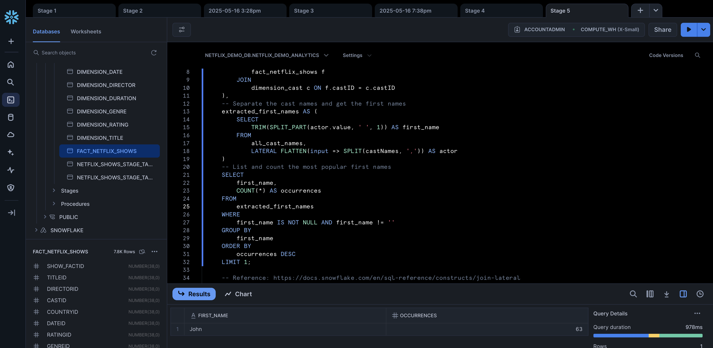
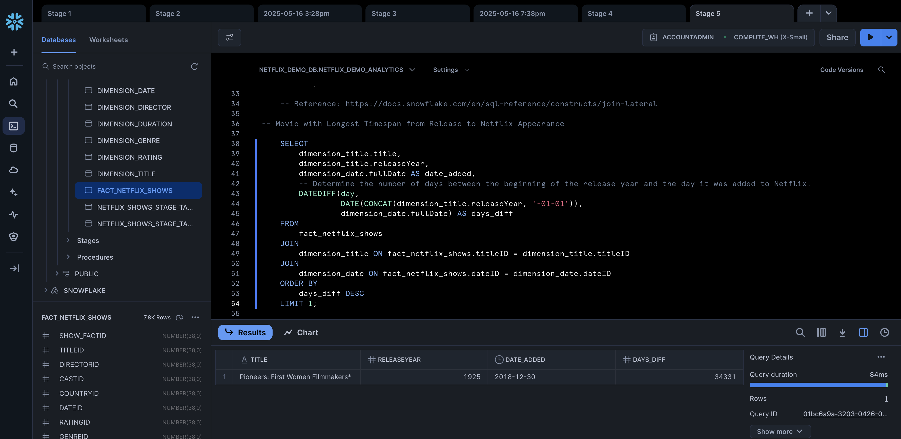
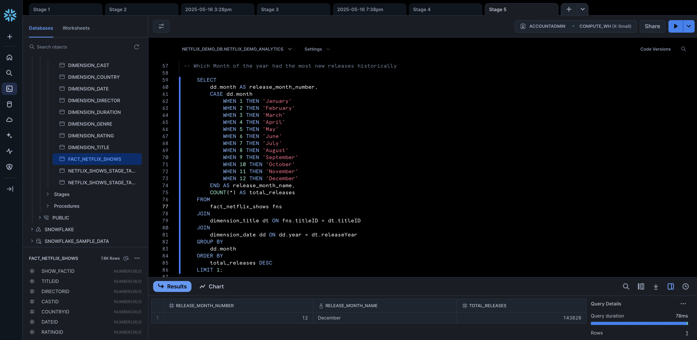
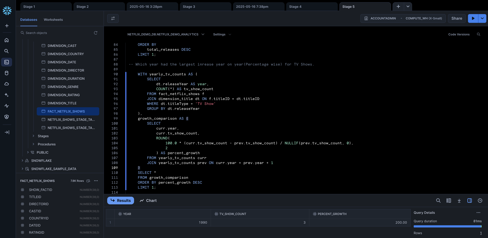
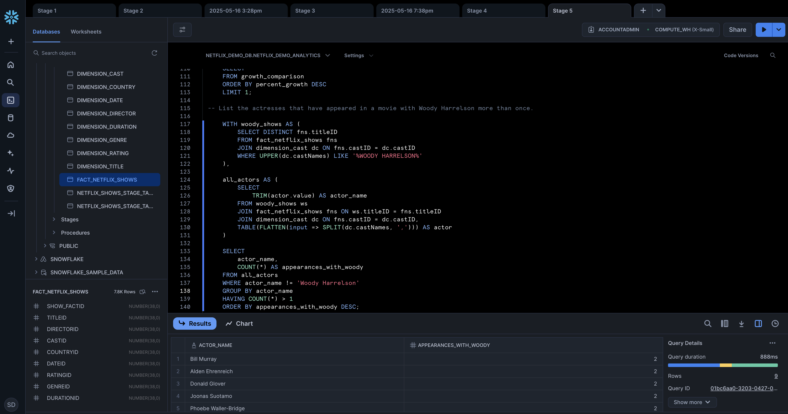

**Souvik – Ambyint Technical Assessment – Data Engineer**

**Stage 5** : Write SQL to return the following:

## Output - Snowflake Views

**1. What is the most common first name among actors and actresses.**

```sql
    -- First, gather all the cast names from the fact table.
    WITH all_cast_names AS (
        SELECT
            c.castNames
        FROM
            fact_netflix_shows f
        JOIN
            dimension_cast c ON f.castID = c.castID
    ),
    -- Separate the cast names and get the first names
    extracted_first_names AS (
        SELECT
            TRIM(SPLIT_PART(actor.value, ' ', 1)) AS first_name
        FROM
            all_cast_names,
            LATERAL FLATTEN(input => SPLIT(castNames, ',')) AS actor
    )
    -- List and count the most popular first names
    SELECT
        first_name,
        COUNT(*) AS occurrences
    FROM
        extracted_first_names
    WHERE
        first_name IS NOT NULL AND first_name != ''
    GROUP BY
        first_name
    ORDER BY
        occurrences DESC
    LIMIT 1;

    -- Reference: https://docs.snowflake.com/en/sql-reference/constructs/join-lateral
```

Query Output:

| FIRST_NAME | OCCURRENCES |
| ---------- | ----------- |
| John       | 63          |

Snowflake View:



**2. Movie with Longest Timespan from Release to Netflix Appearance**

```sql
    SELECT
        dimension_title.title,
        dimension_title.releaseYear,
        dimension_date.fullDate AS date_added,
        -- Determine the number of days between the beginning of the release year and the day it was added to Netflix.
        DATEDIFF(day,
                 DATE(CONCAT(dimension_title.releaseYear, '-01-01')),
                 dimension_date.fullDate) AS days_diff
    FROM
        fact_netflix_shows
    JOIN
        dimension_title ON fact_netflix_shows.titleID = dimension_title.titleID
    JOIN
        dimension_date ON fact_netflix_shows.dateID = dimension_date.dateID
    ORDER BY
        days_diff DESC
    LIMIT 1;
```

Query Output:

| TITLE                              | RELEASEYEAR | DATE_ADDED | DAYS_DIFF |
| ---------------------------------- | ----------- | ---------- | --------- |
| Pioneers: First Women Filmmakers\* | 1925        | 2018-12-30 | 34331     |

Snowflake View:



**3. Which Month of the year had the most new releases historically**

```sql
    SELECT
        dd.month AS release_month_number,
        CASE dd.month
            WHEN 1 THEN 'January'
            WHEN 2 THEN 'February'
            WHEN 3 THEN 'March'
            WHEN 4 THEN 'April'
            WHEN 5 THEN 'May'
            WHEN 6 THEN 'June'
            WHEN 7 THEN 'July'
            WHEN 8 THEN 'August'
            WHEN 9 THEN 'September'
            WHEN 10 THEN 'October'
            WHEN 11 THEN 'November'
            WHEN 12 THEN 'December'
        END AS release_month_name,
        COUNT(*) AS total_releases
    FROM
        fact_netflix_shows fns
    JOIN
        dimension_title dt ON fns.titleID = dt.titleID
    JOIN
        dimension_date dd ON dd.year = dt.releaseYear
    GROUP BY
        dd.month
    ORDER BY
        total_releases DESC
    LIMIT 1;
```

Query Output:

| RELEASE_MONTH_NUMBER | RELEASE_MONTH_NAME | TOTAL_RELEASES |
| -------------------- | ------------------ | -------------- |
| 12                   | December           | 143,828        |

Snowflake View:



**4. Which year had the largest inrease year on year(Percentage wise) for TV Shows.**

```sql
    WITH yearly_tv_counts AS (
        SELECT
            dt.releaseYear AS year,
            COUNT(*) AS tv_show_count
        FROM fact_netflix_shows f
        JOIN dimension_title dt ON f.titleID = dt.titleID
        WHERE dt.titleType = 'TV Show'
        GROUP BY dt.releaseYear
    ),
    growth_comparison AS (
        SELECT
            curr.year,
            curr.tv_show_count,
            ROUND(
                100.0 * (curr.tv_show_count - prev.tv_show_count) / NULLIF(prev.tv_show_count, 0),
                2
            ) AS percent_growth
        FROM yearly_tv_counts curr
        JOIN yearly_tv_counts prev ON curr.year = prev.year + 1
    )
    SELECT *
    FROM growth_comparison
    ORDER BY percent_growth DESC
    LIMIT 1;
```

Query Output:

| YEAR | TV_SHOW_COUNT | PERCENT_GROWTH |
| ---- | ------------- | -------------- |
| 1990 | 3             | 200.00%        |

Snowflake View:



**5. List the actresses that have appeared in a movie with Woody Harrelson more than once.**

```sql
    WITH woody_shows AS (
        SELECT DISTINCT fns.titleID
        FROM fact_netflix_shows fns
        JOIN dimension_cast dc ON fns.castID = dc.castID
        WHERE UPPER(dc.castNames) LIKE '%WOODY HARRELSON%'
    ),

    all_actors AS (
        SELECT
            TRIM(actor.value) AS actor_name
        FROM woody_shows ws
        JOIN fact_netflix_shows fns ON ws.titleID = fns.titleID
        JOIN dimension_cast dc ON fns.castID = dc.castID,
        TABLE(FLATTEN(input => SPLIT(dc.castNames, ','))) AS actor
    )

    SELECT
        actor_name,
        COUNT(*) AS appearances_with_woody
    FROM all_actors
    WHERE actor_name != 'Woody Harrelson'
    GROUP BY actor_name
    HAVING COUNT(*) > 1
    ORDER BY appearances_with_woody DESC;
```

Query Output:

| ACTOR_NAME           | APPEARANCES_WITH_WOODY |
| -------------------- | ---------------------- |
| Bill Murray          | 2                      |
| Alden Ehrenreich     | 2                      |
| Donald Glover        | 2                      |
| Joonas Suotamo       | 2                      |
| Phoebe Waller-Bridge | 2                      |
| Paul Bettany         | 2                      |
| Emilia Clarke        | 2                      |
| Thandie Newton       | 2                      |
| William Sadler       | 2                      |

Snowflake View:

